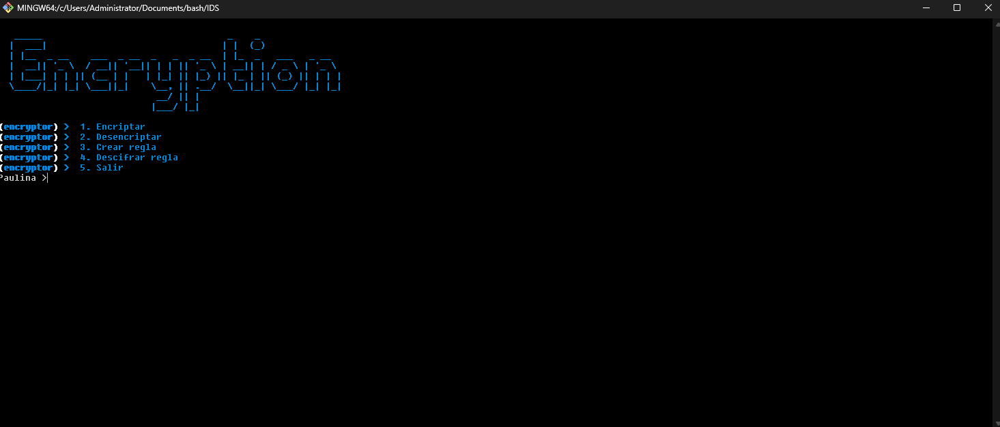
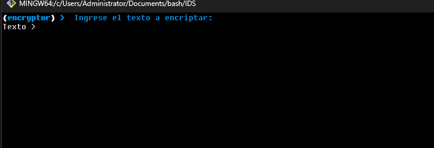
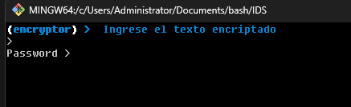
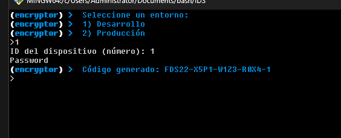
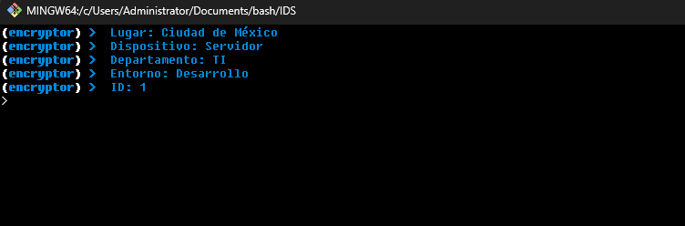

# **Install**
## Requisitos previos

Asegúrate de tener instalado `git` y `bash` en tu sistema.
1. **Instalar `git`:**

   - **En Ubuntu/Debian**:  
     ```bash
     sudo apt update
     sudo apt install git
     ```

   - **En macOS**:  
     Usa Homebrew para instalar git:
     ```bash
     brew install git
     ```

   - **En Windows**:  
     Para instalar `git` en Windows, sigue estos pasos:
     1. Ve al [sitio web oficial de Git para Windows](https://git-scm.com/download/win).
     2. Descarga el instalador correspondiente a tu versión de Windows.
     3. Ejecuta el instalador y sigue las instrucciones predeterminadas. Asegúrate de seleccionar la opción para agregar Git al `PATH` durante la instalación.

     Una vez instalado, puedes verificar la instalación abriendo la terminal y ejecutando:

     ```bash
     git --version
     ```

2. **Instalar `bash`**:  bash generalmente viene preinstalado en la mayoría de sistemas operativos. Si no lo tienes, puedes instalarlo utilizando el gestor de paquetes correspondiente a tu sistema.

## Clonar el repositorio

Para clonar el repositorio de `IDS.Bash`, abre una terminal y ejecuta el siguiente comando:

  ```
- git clone https://github.com/ALetsee/IDS.git
- cd IDS
- bash IDS.sh
  ```


# **IDS**

Este código es un **script interactivo en Bash** diseñado para realizar varias funciones de encriptación y gestión de reglas con codificación. Está estructurado en un menú de opciones, donde el usuario puede elegir entre encriptar, desencriptar, crear una nueva regla o descifrar una regla ya creada. El código usa varias características de Bash, como arrays asociativos, bucles `while`, y comandos de encriptación como `base64`.

## Funciones Principales

### 1. **Encriptar**
   - Solicita al usuario un texto y una contraseña.
   - Encripta el texto utilizando `base64` y lo guarda junto con la contraseña en un archivo llamado `encriptados.dat`.
   - Muestra el texto encriptado al usuario.

### 2. **Desencriptar**
   - Solicita al usuario un texto encriptado y una contraseña.
   - Busca en el archivo `encriptados.dat` para verificar si la contraseña y el texto coinciden.
   - Si coinciden, se desencripta el texto utilizando `base64 --decode` y se muestra al usuario.

### 3. **Crear Regla**
   - Permite al usuario crear una regla asociando un lugar, dispositivo, departamento y entorno con un ID y contraseña.
   - El código utiliza arrays asociativos para almacenar los valores de lugares, dispositivos, departamentos y entornos.
   - Después de seleccionar cada opción, genera un código único que se guarda en un archivo llamado `reglas.dat` junto con la contraseña.

### 4. **Descifrar Regla**
   - Permite al usuario ingresar un código de regla y una contraseña para descifrar la información asociada a ese código.
   - Verifica si la contraseña corresponde al código y, si es correcto, muestra el lugar, dispositivo, departamento, entorno y el ID asociado a esa regla.

## Variables y Datos Utilizados

### Arrays Asociativos
   - **lugares**: Almacena códigos de lugares como "Ciudad de México" y "Guadalajara".
   - **dispositivos**: Almacena tipos de dispositivos como "Servidor", "Computadora", "Impresora", etc.
   - **departamentos**: Almacena nombres de departamentos como "TI", "RH", y "Carrera".
   - **entornos**: Almacena los tipos de entorno como "Desarrollo" y "Producción".

### Archivos Utilizados
   - **encriptados.dat**: Almacena los textos encriptados junto con su contraseña.
   - **reglas.dat**: Almacena las reglas generadas con su código único y contraseña.

## Flujo de Ejecución

1. El usuario accede al menú principal.
2. Dependiendo de la opción seleccionada, el script ejecuta una de las funciones (encriptar, desencriptar, crear regla o descifrar regla).
3. En caso de encriptación o creación de regla, se guarda la información en un archivo. En caso de desencriptación o descifrado de reglas, se verifica la información proporcionada.

## Propósito

Este script tiene como objetivo facilitar la gestión de datos sensibles, ya sea en forma de textos encriptados o reglas de identificación, asegurando que solo aquellos con las contraseñas correctas puedan acceder a la información. Además, proporciona una forma sencilla de generar reglas que pueden estar asociadas a ubicaciones, dispositivos, departamentos y entornos específicos.

